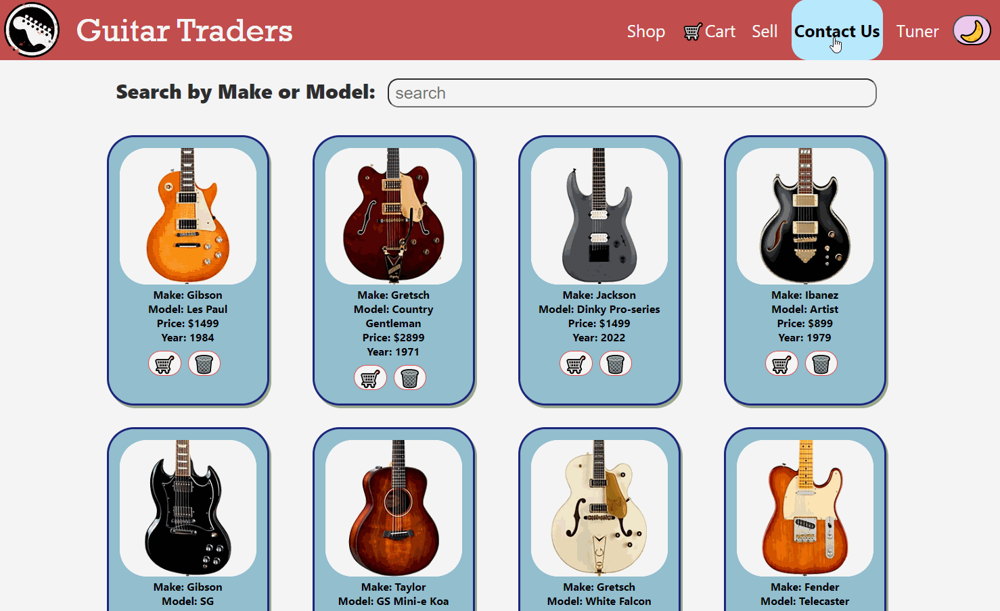

# Guitar Traders Inc.
GuitarTraders is a multi-page React application for buying and selling guitars. You can filter guitars by make and model, add them to a cart, and list your guitar(s) for sale.

## Installation
* fork and clone this repository
* navigate to the directory on your local terminal with `cd <directory-name>`
* run `code .` to open the content in VSCode
* run `npm install` to install the necessary packages into dependencies
* run `npx json-server --watch db.json --port=3001` to simulate the backend server
* in a split/sperate terminal, run `npm start` which will open the React application in `localhost:3000`

## Application Features
1. Select between light and dark mode.

  
 

2. Search for a guitar by its Make or Model.

  
 

3. Remove items from the guitar selection that you do not want by clicking on the trash icon.

  
 

4. Add Items from the guitar selection to the checkout cart by clicking on the cart icon. To check the guitars in your cart so far, click on the cart icon at the top right-hand corner of the web page. Remove any guitars you do not want to purchase anymore by clicking on the trash icon. The total price will change according to the items added to or removed from your cart.

  
 

5. To put your guitar up for sale, click on the 'Sell' link on the Navigation bar which will take you to a form. Fill out the form and click 'List Your Guitar' to have your guitar listed on the page for sale.

  
 

6. For information about contacting our organization, click on the 'Contact Us' link in the Navigation bar.

  
 

7. To find a quick guitar tuner, click on the 'Tuner' link in the Naviation bar which will take you to an external website that hosts an online tuner.

  
 

8. Links to the organization's socials can be found in the footer of the web page and a 'Back to Top' button can be clicked to jump back to the top of the page.

  
   

## Contributing
Open to pull requests. For major changes, please open an issue first to discuss what you would like to change.  
 

## Authors and Acknowledgements
### Contributors:
* [riverferguson](https://github.com/riverferguson)
* [salvat36](https://github.com/salvat36)
* [Blujay0](https://github.com/Blujay0)  
 

## License
[MIT](https://choosealicense.com/licenses/mit/)
